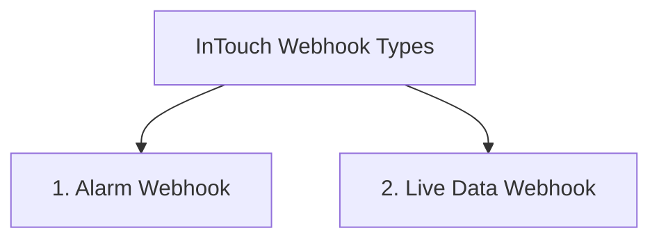
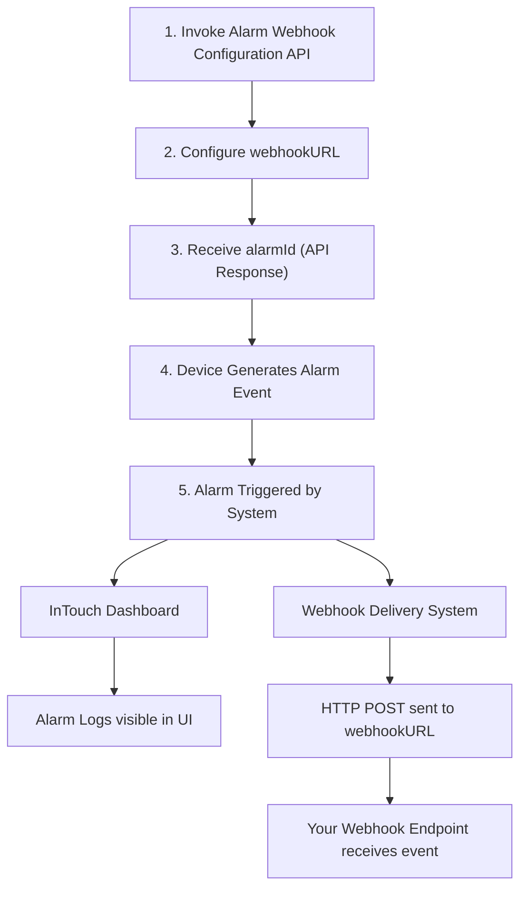

[ </p>](https://about.mappls.com/api/)

# Webhook Guide
## **Overview**
InTouch supports two types of webhooks to deliver data in real time without requiring continuous API polling.


## **1. Alarm Webhook**
### **Introduction**
The Alarm Webhook allows your application to receive **real-time alarm notifications** from the InTouch system.

Instead of continuously polling the `Fetch Alarm Logs API`, you can configure a `webhookURL` while creating an alarm. Whenever the configured alarm is triggered, InTouch sends an HTTP `POST` request containing the alarm payload to your endpoint.

> **Note:** The Alarm Webhook is user-configurable. Users can add their own webhook URL from the InTouch Portal while creating or managing an alarm.

### **How It Works**


### **Prerequisites**
Before configuring a webhook, ensure that:
- Your endpoint is publicly accessible over HTTPS.
- Your server accepts HTTP `POST` requests.
- Your endpoint returns an HTTP `200 OK` response after successfully processing the request.
- Your application can parse `JSON request bodies`.

### **Configure a Webhook**
Provide your webhook endpoint using the `webhookURL` parameter while creating the alarm.

Each alarm event is delivered as a real-time HTTP POST request to the configured endpoint.
- Example: `https://webhook.site/<your-id>`

### **HTTP Request**
- Whenever an alarm is triggered, InTouch sends an HTTP request with:
    - **Method**: `POST`
    - **Content-Type**: `application/json`

### **Sample Request Payload**
```json
{
  "generationTime": 1782904098,
  "data": {
    "id": 15189719,
    "alertId": "AL94am4IthhtluT26G10iedD2",
    "timestamp": 1782904098,
    "location": {
      "type": "Point",
      "coordinates": [
        77.2679387,
        28.550919
      ]
    },
    "alertType": 26,
    "configuredLimit": 0,
    "alertData": 2,
    "deviceId": 15316924,
    "geofenceId": 1703461
  },
  "type": "alarm",
  "version": "Release-12.0.0",
  "deviceId": 15316924,
  "deviceName": "Vandana(webhook test)",
  "tripId": "null"
}
```

### **Expected Response**
Your endpoint should return an HTTP success response after processing the notification. Example: `HTTP/1.1 200 OK`

### **Failure Cases**
If your endpoint returns:
- `400`: Invalid request handling
- `500`: Server error

The webhook delivery is considered **unsuccessful**.
<br></br>

## **2. Live Data Webhook**
### **Introduction**
The Live Data Webhook enables customers to receive real-time device telemetry data from the InTouch platform.

Unlike the Alarm Webhook, this feature is configured by the **InTouch Admin**. Once configured, InTouch automatically pushes live device data to the customer's webhook endpoint whenever new telemetry is received.

### **How It Works**
1. The customer shares a webhook endpoint with the InTouch Admin.
2. The InTouch Admin configures the customer's `webhook URL`.
3. The `Send Data To External` device feature is enabled.
4. InTouch automatically pushes live device data to the configured webhook endpoint.
5. The customer's application processes the payload and returns HTTP `200 OK`.

### **Prerequisites**
Before using the Live Data Webhook, ensure that:
- Your endpoint is publicly accessible over HTTPS.
- Your server accepts HTTP `POST` requests.
- Your application can parse `JSON` request bodies.
- Your endpoint returns `HTTP 200 OK` after successfully processing the request.


### **Admin Configuration**
The following configuration is performed **`only by the InTouch Admin`**. End users cannot configure these settings.
- Configure the customer's `webhook` endpoint.
- Enable the `Send Data To External` device feature.

Once configured, InTouch automatically pushes live data packets to the customer's webhook endpoint.

### **Customer Responsibility**
Customers are only required to:
- Provide a publicly accessible HTTPS webhook endpoint.
- Accept HTTP POST requests.
- Parse the JSON payload.
- Return an `HTTP 200 OK` response after successfully processing the request.

No additional configuration is required from the customer within the InTouch Portal.

### HTTP Request
Whenever new live device data is received by InTouch, an HTTP `POST` request is sent to the configured webhook endpoint:
    - **Method**: `POST`
    - **Content-Type**: `application/json`

### Sample Request Payload
```json
[
    {
        "accountId": 6488681,
        "deviceId": 9546651,
        "entityId": [
            14914589
        ],
        "uniqueId": "353201353484238",
        "vehicleName": "KL40V5082",
        "trailerNumber": "KL40V5082",
        "address": "Eirappurampara Koottakanjiram Road, Pattimattom, Kunnathunad, Ernakulam District, Kerala. 194 m from Jawan Raman Nair Memorial Vyayamshala, Pin-683565 (India)",
        "h3Index": "8a6031a0b80ffff",
        "timestamp": 1784083795,
        "day": 15,
        "month": 6,
        "year": 2026,
        "insertTime": 1784083798,
        "createdAt": "Jul 15, 2026 8:19:58 AM",
        "longitude": 76.4382066,
        "latitude": 10.032435,
        "heading": 258.0,
        "speed": 12.0,
        "areaCode": "49900",
        "cellId": "11912",
        "hdop": 5.0,
        "numberOfSatellites": 21,
        "digitalInput1": 1,
        "altitude": 14.0,
        "powerSupplyVoltage": 13898.0,
        "internalBatteryVoltage": 3901.0,
        "power": 1,
        "movementSensor": 1,
        "gsmlevel": 4,
        "serviceProvider": "40495",
        "valid": true,
        "gpsFix": false,
        "indianBox": false,
        "validGPS": false,
        "accOff": false,
        "engineFuelRate": 80,
        "gpsOdometer": 52222.807,
        "deviceOdometer": 52222.807,
        "type": 0,
        "battryCurrent": 139.0,
        "gpsState": 1,
        "gprsState": 1,
        "transReason": 1,
        "processFlags": {},
        "movementStatus": "moving",
        "tripStatus": 0,
        "sleepMode": 0,
        "tripOdometer": 15.899,
        "externalSensor": [],
        "typeIdentificationCode": 0,
        "timeZoneLanguage": 0,
        "processingTimestamp": 1784083798,
        "canData": {
            "engineFuelRate": 80.0,
            "battryCurrent": 139.0
        },
        "otherData": {
            "24": 12.0,
            "69": 1.0,
            "80": 5.0
        },
        "tollEdgeId": [],
        "port": 4003,
        "canValid": true,
        "deltaDistance": 0.01358268695324534,
        "chargingStatus": 0,
        "history": false
    }
]
```
## Expected Response
Your endpoint should return: `HTTP/1.1 200 OK`

### Failure Cases
If your endpoint returns:
- **400 Bad Request:** Invalid request received.
- **500 Internal Server Error:** Server-side processing error.

The webhook delivery is considered **unsuccessful**.


<br></br>

For any queries and support, please contact: 

[ </p>](https://about.mappls.com/api/)
Email us at [apisupport@mappls.com](mailto:apisupport@mappls.com)


[Support](https://about.mappls.com/contact/)
Need support? contact us!

<br></br>


<br></br>

[<p align="center">  ](https://stackoverflow.com/questions/tagged/mappls-api)[](https://about.mappls.com/blog/)[](https://github.com/Mappls-api)[ </p>](https://www.npmjs.com/org/mapmyindia) 


[<p align="center">  ](https://www.facebook.com/Mapplsofficial)[](https://twitter.com/mappls)[](https://www.linkedin.com/company/mappls/)[](https://www.youtube.com/channel/UCAWvWsh-dZLLeUU7_J9HiOA)


<div align="center">@ Copyright 2026 CE Info Systems Ltd. All Rights Reserved.</div>

<div align="center"> <a href="https://about.mappls.com/api/terms-&-conditions">Terms & Conditions</a> | <a href="https://about.mappls.com/about/privacy-policy">Privacy Policy</a> | <a href="https://about.mappls.com/pdf/mapmyIndia-sustainability-policy-healt-labour-rules-supplir-sustainability.pdf">Supplier Sustainability Policy</a> | <a href="https://about.mappls.com/pdf/Health-Safety-Management.pdf">Health & Safety Policy</a> | <a href="https://about.mappls.com/pdf/Environment-Sustainability-Policy-CSR-Report.pdf">Environmental Policy & CSR Report</a>

<div align="center">Customer Care: +91-9999333223</div>

